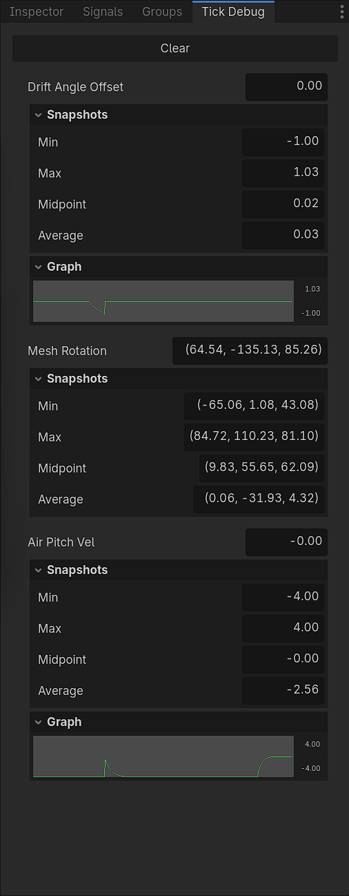

> Currently only available on GitHub.

> Tested with Godot Versions: `4.5.1`, `4.6.3`, `4.7.1`


## What is it?

**TickDebug** lets you **watch quickly changing values** on the fly, without `print()` spamming your output or setting up a label just to check one number.

It offers an **ingame panel** and **editor dock** to look at your tracked values, which get there using functions of the provided **Autoload**. 

Currently, **numbers** have the biggest range of features. Most built-in Variant types are supported for simple display, while anything numeric also gets the tracking of **minimum**, **maximum**, **average** and **midpoint** values. Integers and floats additionally show a simple **line graph**. \
A quick way to **add support for other types** yourself is provided.

### Quick use
- Call `TickDebug.track(value, caller, custom_id)` anywhere to log a value, similar to how you'd use `print()`
  - `caller` identifies where the value came from — almost always `self`
  - `custom_id` is a label of your choice for easier identification
- To see the tracked values, either open the **editor dock** next to your inspector, or press **F4** in play mode to open the **ingame panel** (rebindable via the `"toggle_tick_debug_panel"` input action)
- Additional **settings** are available under `Project > Project Settings > Debug > TickDebug`


## How to install

Get the addon via one of these:
- **[GitHub Releases](https://github.com/HannesParth/tick-debug/releases)** — always up to date, recommended if in doubt
- Install directly through the **Asset Store** - check that the listed version matches the latest GitHub release; continue directly with **Activation**
- Download from the **Asset Library** - same as with the Asset Store, verify the version first

Then:
- Move the `tick_debug` folder into your own `addons` folder
- This will trigger some compilation errors, because a lot of the addon's scripts use its Autoload, which is only added after it is activated

\
**Activation:**
- Activate the addon at `Project > Project Settings > Plugins`
- Reload your project (`Project > Reload Current Project`) to make everything initialize with the Autoload correctly


## Usage Example

Call the Autoload anywhere you want an update on your value. This is from an arcade vehicle controller:
```gdscript
func _physics_process(_delta: float) -> void:
	TickDebug.track(_drift_angle_offset, self, &"Drift Angle Offset")
	TickDebug.track(_vehicle_mesh_parent.rotation_degrees, self, &"Mesh Rotation")
	TickDebug.track(_air_pitch_velocity, self, &"Air Pitch Vel")
```

The resulting editor dock looks like this:




### Some info about the editor dock and ingame panel

The editor dock is automatically cleared when you *start* playmode, not when you end it. This way, you can look at the last values without having to stay in or pause playmode. \
If you don't want it or notice some unexpected performance impact, the editor dock can be disabled using the provided project settings at `Project Settings > Debug > TickDebug`.

The values get from runtime to the editor dock using an [EditorDebuggerPlugin](https://docs.godotengine.org/en/stable/classes/class_editordebuggerplugin.html#class-editordebuggerplugin).\
**This connection has a message queue limit**, which can be reached if you track a lot of values at once. \
TickDebug catches this and logs a single error message to the output console, instead of letting Godot's own `Too many messages!` error trigger.

However, if this does happen, the editor dock **will have gaps between updates**. In this case, you will need to use the ingame panel for assured per-frame updates.

\
The ingame panel can be toggled using the `"toggle_tick_debug_panel"` input action (default **F4**). You can change this by creating an input action with the same name.\
The ingame panel can also be **dragged** by its top bar.


## API

All public functions are explained with in-editor documentation comments, so press F1 for the help menu and look at `TickDebug` to get more actionable details.

\
``TickDebug.track(p_value: Variant, p_caller: Node, p_custom_id: StringName)``
- The main function of this addon, which initiates/updates the last tracked value of something.
- If a type of value is not supported, an error will tell you. For more, see [Supported types and supporting types](#supported-types-and-supporting-types).
- The caller reference is used to construct an ID for that tracked value, preventing the same custom IDs out of different nodes from updating the same value.
- The custom ID is used as the second part to construct the value's internal ID, and as the display name of your value.

\
``TickDebug.untrack(p_caller: Node, p_custom_id: StringName)``
- Actively removes a value from tracking and display.
- Mostly in case you really want to free more space in the UI at runtime, since this does not prevent the value from being tracked again the next frame.

\
``TickDebug.register_track_type(p_track_type: TiDeTrackType)``
- Registers a new or overrides an existing track type, see [Supported types and supporting types](#supported-types-and-supporting-types).


### Class Names

This addon brings some named classes with it, because I am a sucker for clean static typing. However, you should never have to interact directly with them. Hence, all named classes besides the Autoload have gotten the `TiDe` prefix, to make them less likely to clutter your autocomplete.\
The only one of these classes that could ever be relevant for users is `TiDeTrackType`. For why, see [Supported types and supporting types](#supported-types-and-supporting-types).


## Supported types and supporting types

**Default supported types** can be found in `/addons/tick_debug/scripts/track_types/`. \
These currently are:
- `int`
- `float`
- `bool`
- `String`
- `Color`
- `Vector2`
- `Vector2i`
- `Vector3`
- `Vector3i`

\
When a value is tracked with TickDebug, a `ValueData` object is created to keep track of it (get it) (see [the bottom of the Autoload](./demo/addons/tick_debug/scenes/tick_debug.gd) for that inner class). \
[Track Types](./demo/addons/tick_debug/scripts/track_types/tick_track_type.gd) are then used to provide the operations necessary. This abstract class can be extended to provide all the calculations, checks and formatting needed for a type. Since only the return values of these functions are important, this means you can easily add support for other built-in types, objects and custom classes.


#### Enum Disclaimer

There is no `enum` in `Variant.Type`, since enums are just constants with int values. Because of that, just like when using `print` with an enum value, if you directly put an enum value into `TickDebug.track`, you will get an int. 

If you want the name of that value, use `MyEnum.keys()[my_enum_value]`. Just be aware that this returns a String, so you are effectively tracking a String. \
There is, to my knowledge, no way to get the name of built-in enums like `Key` from `@GlobalScope`.


### How to add support for a type

1. Create a new script and extend `TiDeTrackType`
2. Override and implement all abstract functions (they all have descriptions, hover for tooltip)
3. Call `TickDebug.register_track_type(YourNewType.new())` in any `_init()` function of a script that gets loaded before you track your type
- If you don't want to give your Track Type a class so as to not clutter your autocomplete, use `preload("res://path/to/your/script.gd").new()` instead


## Known Bugs

- Something in the setup of the plugin causes a `WARNING: core/variant/variant_utility.cpp:1033 - Created! 1524747015819`. I have not yet found why this happens, but it does not seem to have any effect.


## AI Disclaimer

LLM AI was used in this project for writing some functions and for feedback on architecture. In my estimation, 20-30% of this project was directly or indirectly influenced by an AI chatbot.\
Jokes on me, I wrote all of the documentation myself.
